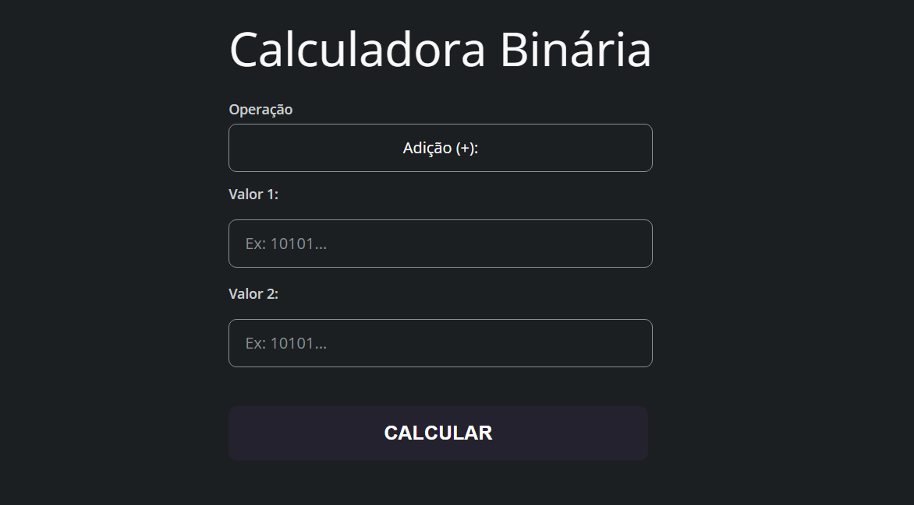

 

    

## 💻 Project
A responsive web application designed to practice JavaScript fundamentals and programming logic through the development of a binary value calculator.

## 👩‍💻 Tecnologias
This project was developed using the following technologies:

- HTML
- CSS
- GIT E Github
- JavaScript
